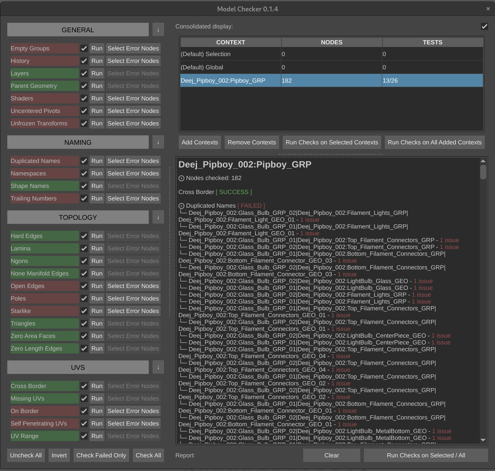

<h1 align="center">modelChecker</h1>

modelChecker is a python plug-in written for Autodesk Maya to sanity check digital polygon models. It is unopinionated, provides concise reporting, and lets you select your error nodes easily.



## Install

Download the [modelChecker.zip](https://github.com/JakobJK/modelChecker/archive/main.zip) and place the modelChecker folder in your Maya scripts directory and create a python shelf button with the following code:

```python
from modelChecker import modelChecker_UI

modelChecker_UI.UI.show_UI()
```

## Usage

There are three ways to run the checks.

1. If you have objects selected, the checks will run on the current selection. Select objects in object mode. (component mode won't work).
2. On a hierarchy by declaring a root node in the UI.
3. The checks will run on the entire scene if nothing is selected and the root node field is left empty.

## Authors

- [**Jakob Kousholt**](https://www.linkedin.com/in/jakobjk/) - Software Engineer
- [**Niels Peter Kaagaard**](https://www.linkedin.com/in/niels-peter-kaagaard-146b8a13) - Senior Modeler at Weta Digital

## Support & Feedback

For any bugs, errors, and requests, feel free to reach out to [Jake](mailto:jakobjk@gmail.com)

If you want to support us, feel free to "buy" the modelChecker from [Gumroad](https://jakejk.gumroad.com/l/htZYj).

## License

modelChecker is licensed under the [MIT](https://rem.mit-license.org/) License.
